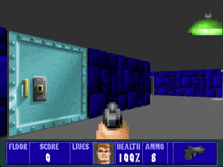
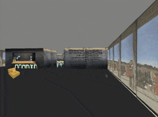

# cub3d

This branch contains the game version available at [omelhorsite.pt](https://omelhorsite.pt/en/games/cub3d).

Developed by **[Afonso Coutinho](https://github.com/afonsopc)** and **[Paulo Cordeiro](https://github.com/pvcordeiro)**.

<div align="center">
  
</div>

## About the Game

Cub3D is a project inspired by the classic [Wolfenstein 3D](https://en.wikipedia.org/wiki/Wolfenstein_3D), developed as part of the [42](https://www.42lisboa.com) curriculum.

The project explores mathematical concepts of raycasting to simulate a three-dimensional environment on a 2D screen, handling textures, collisions, audio, controller integration (Xbox, PlayStation, etc.), simple AI algorithms for enemies, and more.

The project features two main maps:

*   🏫 **42 Lisboa:** A 3D version of the [42 Lisboa](https://www.42lisboa.com) campus that you can explore.
*   🕹️ **Wolfenstein 3D:** A complete *first-person shooter* with enemies, weapons, collectibles, elevators, the first two floors from the original game, and a secret bonus floor.

### Web Version

The game also runs on the web using **SDL** and **Emscripten**, making it easy to play in the browser.

You can play it here: [https://omelhorsite.pt/en/games/cub3d](https://omelhorsite.pt/en/games/cub3d)

<div align="center">
  
</div>

## How to Compile

### Desktop Version (Linux/macOS)

To compile the native version of the game, ensure you have the necessary dependencies (SDL2) and run:

```bash
make
```

To run the game, provide a map as an argument:

```bash
./cub3d [path/to/map.cub]
```

### Web Version (Emscripten)

To compile the web version (WASM), you need to have the Emscripten environment configured. Run:

```bash
make -f emcc.Makefile
```

This will generate the `cub3d.html`, `cub3d.js`, and `cub3d.wasm` files to run the game in the browser.
